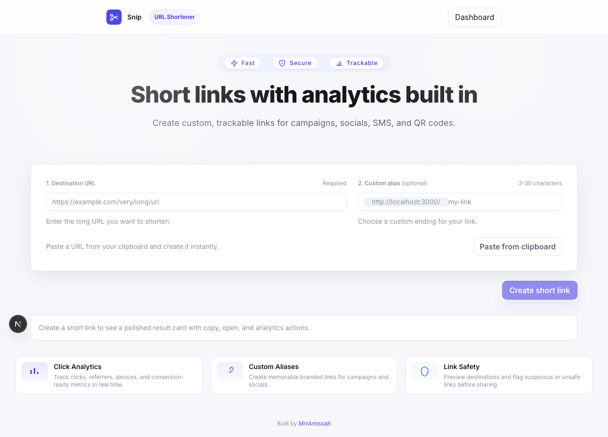

# Snip

Short links. Real-time analytics. No friction.

**Live at [snipnow.vercel.app](https://snipnow.vercel.app)**



---

## What it does

Snip turns any long URL into a clean 7-character short link with full click tracking - no account required. Paste a URL, get a link, see how it performs.

## Features

- Shorten any http/https URL to a 7-character slug
- Custom alias support (3-30 chars: letters, digits, `-` and `_`)
- Click analytics tracked server-side on every redirect
- Dashboard showing your 20 most recent links and click counts
- Zero-latency redirects - click logging runs via `after()`, never blocking the response
- Reserved slug protection (`api`, `dashboard`, `_next`, ...)
- Collision retry - up to 5 attempts before surfacing an error
- 302 redirect for correct browser caching behavior
- PWA-ready with a web app manifest

## Tech stack

| Tool | Role |
|---|---|
| Next.js 16 (App Router) | Framework |
| TypeScript | Type safety |
| Prisma v7 | ORM + migrations |
| Neon Postgres | Serverless database |
| Tailwind CSS v4 | Styling |
| Vitest | Unit tests |

## Run locally

```bash
cp .env.example .env.local
# Fill in DATABASE_URL and DIRECT_URL from your Neon project

npm install
npx prisma migrate dev --name init
npm run dev         # http://localhost:3000
```

## Tests

```bash
npm test
```

Covers `generateSlug()`, `isValidSlug()`, `isValidUrl()`, and `RESERVED_SLUGS`. No database calls.

## Deploy to Vercel

1. Push to GitHub
2. Import the repo in Vercel
3. Add environment variables: `DATABASE_URL`, `DIRECT_URL`, `NEXT_PUBLIC_BASE_URL`
4. Deploy - Prisma generates the client at build time automatically

## Environment variables

| Variable | Description |
|---|---|
| `DATABASE_URL` | Neon pooled connection string |
| `DIRECT_URL` | Neon direct connection string (for migrations) |
| `NEXT_PUBLIC_BASE_URL` | Public base URL, e.g. `https://snipnow.vercel.app` |

---

Built by [MrrAmissah](https://github.com/MrrAmissah) - [LinkedIn](https://www.linkedin.com/in/prince-kofi-frimpong-amissah/)

## License

MIT
